# Screenshots Walkthrough

This document is a visual tour of the HKMA architecture review tooling. Screenshots reflect one client deployment of the static web UI. Buttons that call the **analysis service** use whatever API base URL operations configured for that deployment, not the origin that serves the HTML pages alone.

Use it together with the [BTG Admin Guide](./btg-admin-guide.md), the [Project Team Guide](./project-team-guide.md), and the [Reviewer Guide](./reviewer-guide.md).

PNG files live in `./screenshots/`. To regenerate them locally, start `python -m http.server 8080` in `src/main/webapp`, start `service` on port 3001, then run `npm run capture` in `tools/walkthrough-screenshots`. The capture script stubs Jira and LLM calls for the Reviewer workspace so you do not need live corporate endpoints for documentation images.

---

## Part 1: Projects Portal

### 1.1 Empty portal at first launch

The landing page when no projects exist yet. The top navigation strip includes **Canvas**, **Firewall Rules Panel**, **Projects Portal**, and **Reviewer workspace**. The header provides **+ New Project** for BTG catalogue work.

### 1.2 New Project modal

Choose **+ New Project** to open the modal. You enter project name, project code, owning team, status, assigned people, and description.

### 1.3 Project details filled in

Example project with code **CSP**, team **BTG**, assignees, and description. The analysis service matches Jira work to projects using the project code.

### 1.4 Project card after save

The project appears as a card in the grid. Active status shows as a green badge. Each card supports linking a diagram, linking an IdaC workbook, **Edit**, and **Delete**.

### 1.5 Several projects and filters

With multiple projects, the search field plus **Status** and **Team** filters refine the list. The counter shows how many projects match.

### 1.6 Linking a diagram file

Choose **Link Diagram** on a card. The operating system file picker opens for `.drawio` and XML files. The picker itself is not shown here because it is native to the device.

### 1.7 Linked diagram strip

After linking, the card shows the file name, link time, **Open in Canvas**, **Download .drawio**, and unlink.

### 1.8 Linked IdaC workbook

After you link the IdaC workbook produced from the canvas menu **Export firewall** using the IdaC template, a second strip appears with download and unlink actions.

### 1.9 Analysis panel when the service is unavailable

If the analysis service cannot be reached at the configured URL, the card shows a short offline message. The portal remains usable for project and file management.

### 1.10 Analysis panel with results

When the analysis service has stored results for that project, the card can show recent rows with Jira reference, summary, outcome, and a timestamp. Reviewers produce or refresh structured analysis from the **Reviewer workspace**.

### 1.11 Edit project

**Edit** opens the modal with the saved values.

### 1.12 Delete project

Deleting asks for confirmation before the project is removed.

---

## Part 2: Reviewer workspace

The **Reviewer workspace** uses the same top strip as the portal. It is split into separate pages so each task stays in view: **Overview** (`llm-analysis.html`), **New review** (`llm-analysis-review.html`), **Analysed requests** (`llm-analysis-history.html`), and **Assistant chat** (`llm-analysis-chat.html`). A sticky row of links appears on every page.

### 2.1 Overview and connectivity

The **Overview** page introduces the three task pages. Screenshots for documentation were taken from this hub plus the other routes listed below.

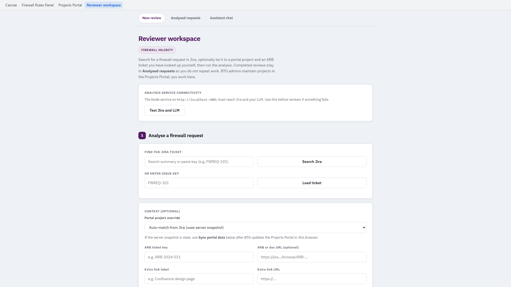

### 2.2 Jira search results

On **New review**, after **Search Jira**, matching firewall requests appear in the results list. Selecting a row loads the ticket into the workflow below.

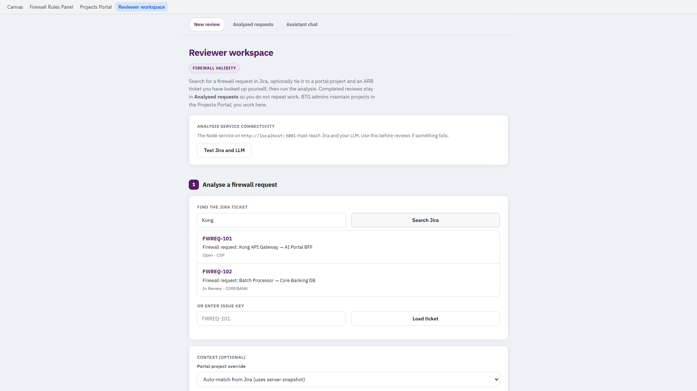

### 2.3 Ticket preview

With a ticket selected or loaded by key, the preview line shows summary, status, project, and **Open in Jira** when the deployment provides a base URL.

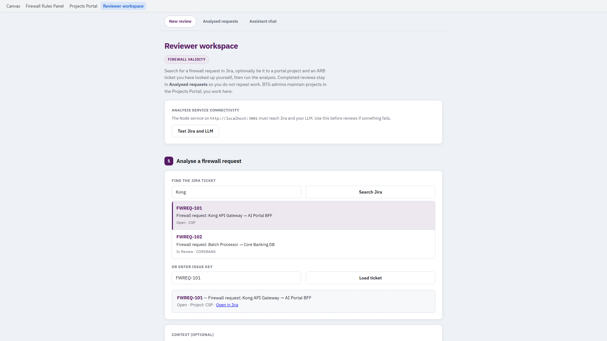

### 2.4 Verdict panel

After **Run validity analysis** on **New review**, the verdict area shows the confidence ring, outcome badge, reasoning list, narrative, and source document links. When the run succeeds, the app opens **Analysed requests** after a short pause so you can read the verdict first.

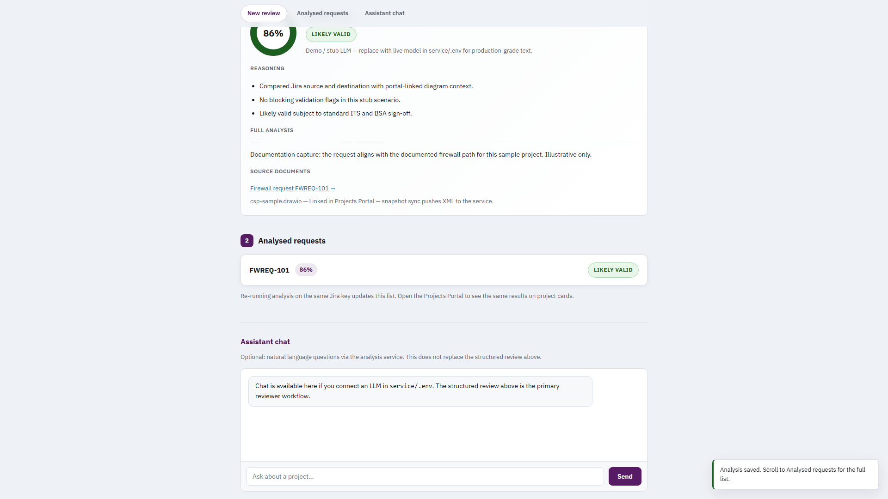

### 2.5 Analysed requests history

Open **Analysed requests** (`llm-analysis-history.html`). Expand rows to see prior reasoning, analysis text, and links. Re-running the same Jira key updates the stored entry.

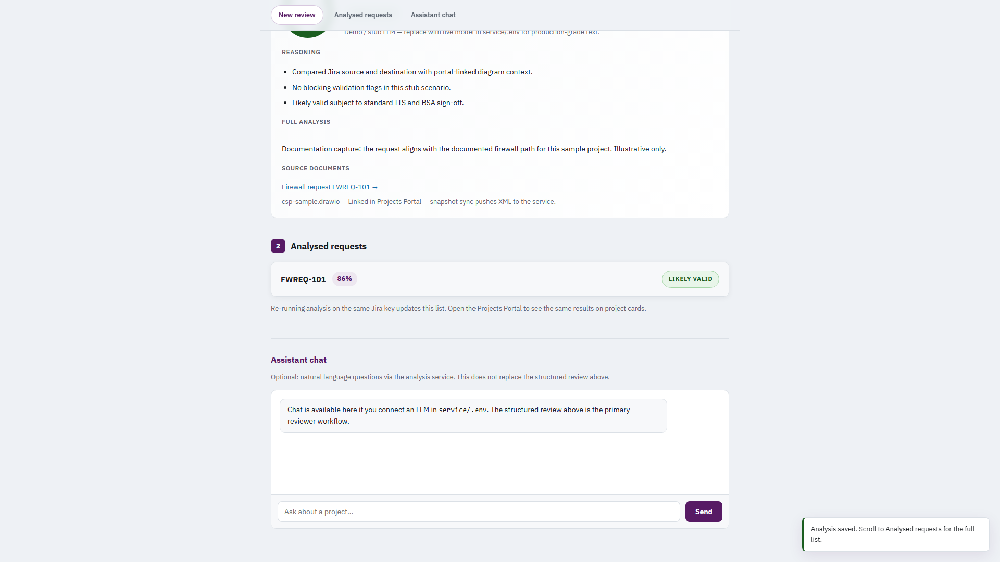

### 2.6 Sync portal data

On **New review**, **Sync portal data** pushes project metadata and diagram artefacts from this browser to the analysis service. A toast confirms success or warns if the service is offline.

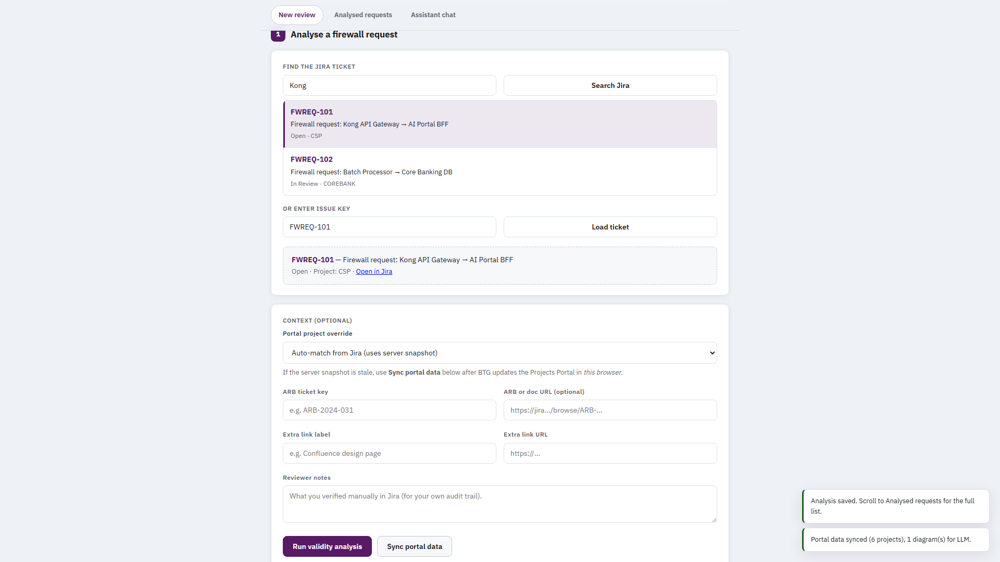

### 2.7 Assistant chat

On **Assistant chat** (`llm-analysis-chat.html`), optional chat streams replies from `POST /api/chat`. Use it after connectivity checks and sync when you want conversational follow-up.

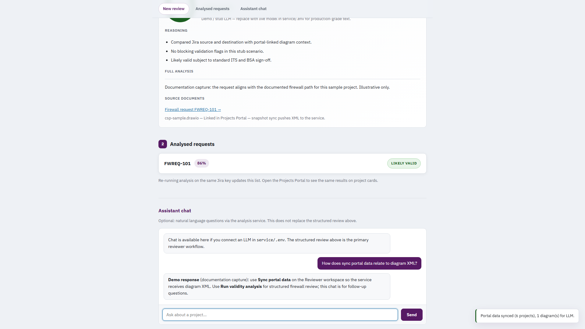

---

## Part 3: Canvas

### 3.1 Canvas home

The diagram editor uses the standard draw.io layout. The left sidebar includes **Architecture** palettes for **Zones** and **Components**.

### 3.2 Zones palette

Expand **Architecture** for **Zones** to browse HKMA zone containers.

### 3.3 Components palette

**Architecture** for **Components** lists schema-driven shapes by category.

### 3.4 File menu

**File** includes **Export Diagram** as `.drawio`, **Export firewall** with the IdaC template, **Extract Firewall Analysis JSON**, **Architecture Admin**, and other editor commands.

### 3.5 View menu

**View** lists zoom, panels, and related display options. You can also open **Architecture Admin** from **File**.

### 3.6 Architecture Admin catalog

**Architecture Admin** from **File** opens the catalog. The dropdown switches between **Zones**, **Components**, **Categories**, and **Styles**. The figure shows **Zones**.

### 3.7 Firewall export preview

**Export firewall** with the IdaC template runs validation, then shows a summary and export actions.

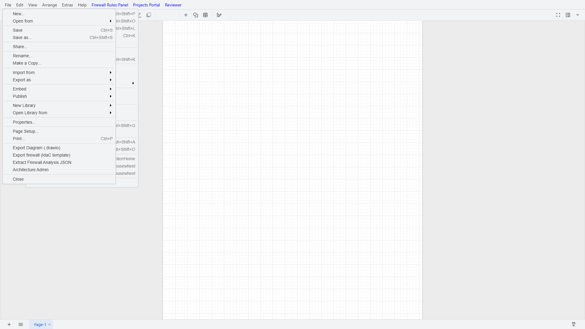

---

## Part 4: Firewall Rules Panel

Organisation-wide firewall precedence and validation rules are maintained on the **Firewall Rules Panel** page. Those settings apply when authors edit diagrams. Reviewers and rule owners change rules here, then choose **Save changes** in the header so updates persist in the browser and refresh open canvas tabs.

### 4.1 Firewall rules overview

The ordered table lists priority, rule id, when conditions apply, effect, and on or off state. **Add rule** is above the table. Each row has **Edit** and **Delete**.

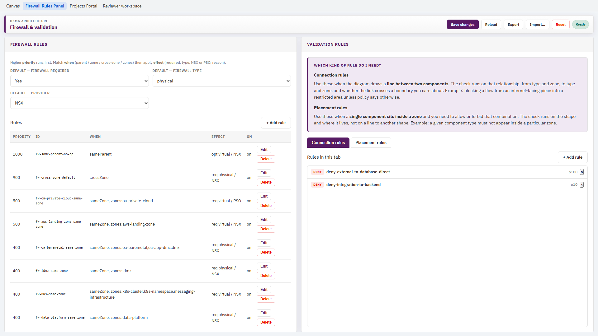

### 4.2 Add a new firewall rule

Choose **Add rule**. Fill **Rule ID**, **Priority**, **When** checkboxes and optional zones, and **Effect** in the modal. Choose **Save** to apply to the working set or **Cancel** to close without saving.

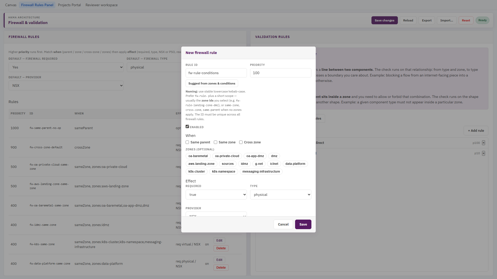

### 4.3 Edit an existing firewall rule

Choose **Edit** on a row. The same form opens with **Edit firewall rule** as the title. Update fields, then **Save** or **Cancel**.

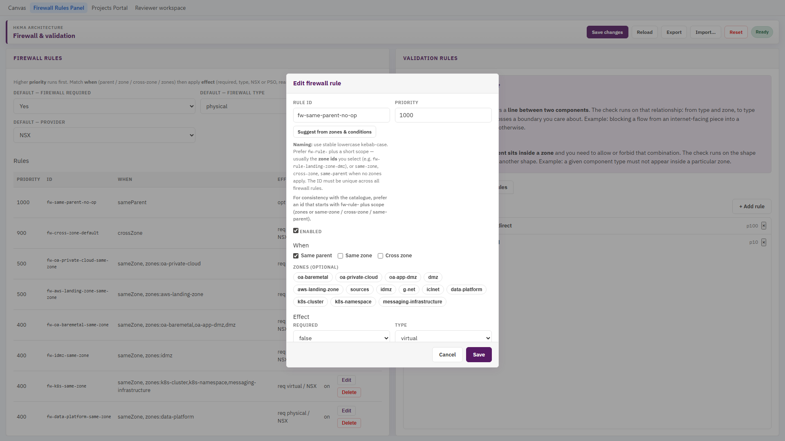

### 4.4 Delete a firewall rule

Choose **Delete** on the row. The browser asks you to confirm.

### 4.5 Connection validation rules overview

Scroll to **Validation rules**. The **Connection rules** tab lists edge rules as rows with **DENY** or **ALLOW**, id, priority, and a delete control.

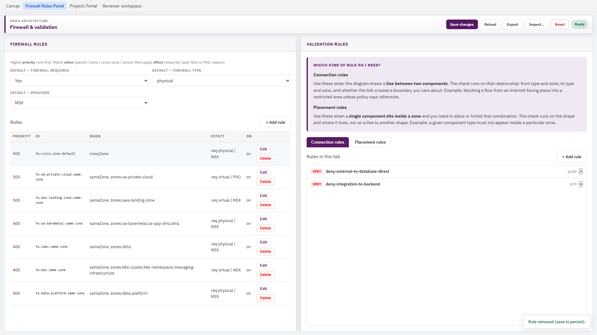

### 4.6 Add a new connection validation rule

Choose **Add rule** while **Connection rules** is active. The **New connection rule** modal collects id, priority, enabled, effect, severity, category and zone chips, and the violation message.

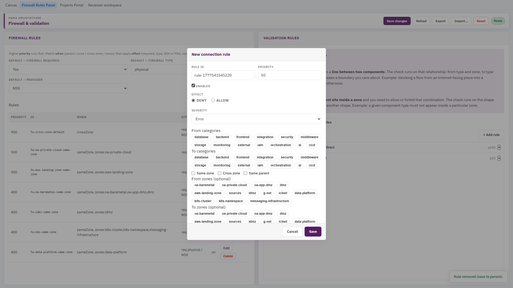

### 4.7 Edit an existing connection validation rule

Click the row for the rule. The modal title starts with **Edit:** and the rule id.

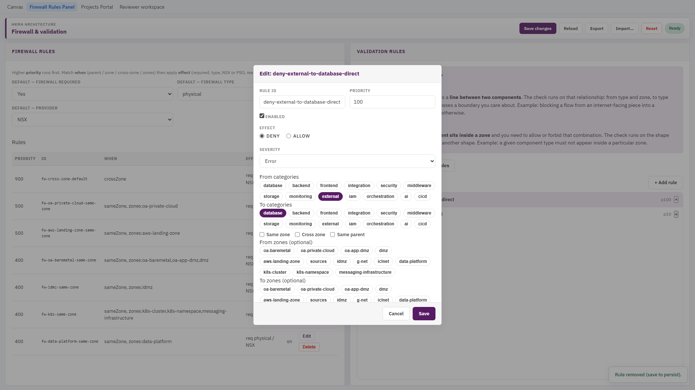

### 4.8 Placement validation rules overview

Choose **Placement rules**. The list shows placement rules the same way as connection rules.

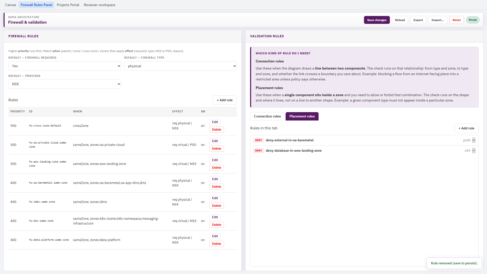

### 4.9 Add a new placement validation rule

Choose **Add rule** while **Placement rules** is active. The **New placement rule** modal shows category and zone chips for containment.

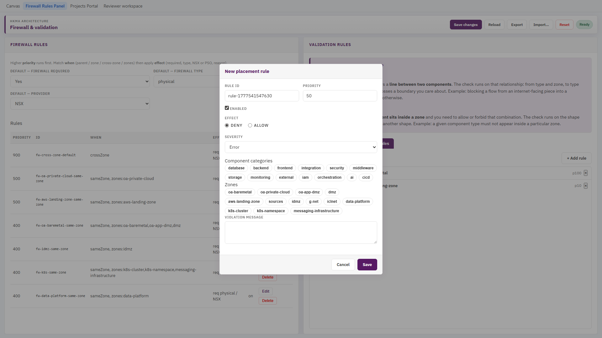

### 4.10 Edit an existing placement validation rule

Click a row when your deployment already defines placement rules.

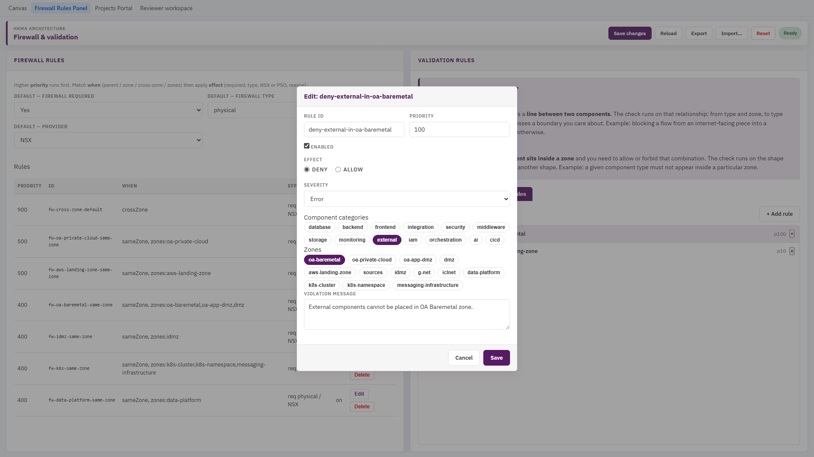

### 4.11 Delete a connection validation rule

Stay on **Connection rules**. Choose **Delete** on a row, confirm, then verify the row is gone.

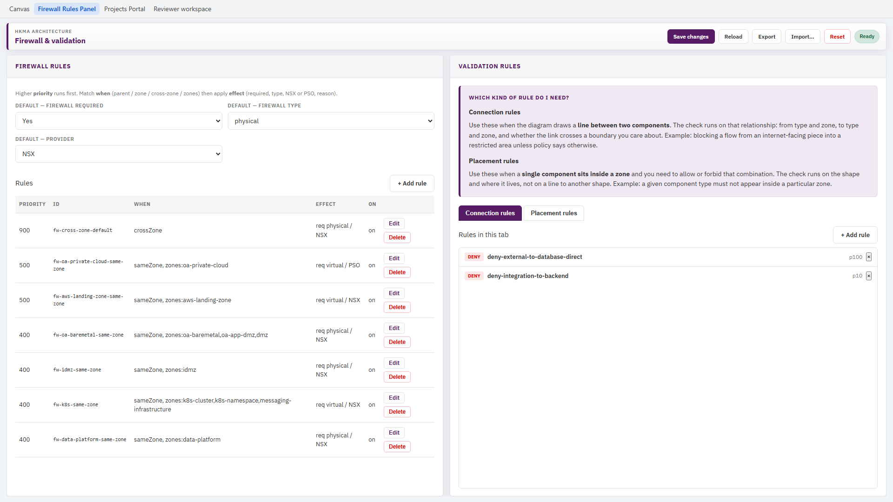

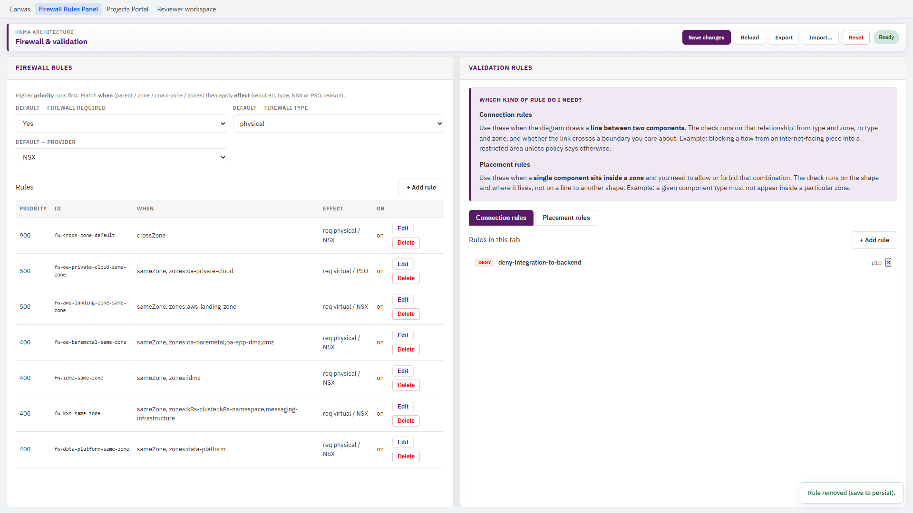

### 4.12 Persist your work

When finished, choose **Save changes** in the page header so organisation overrides are written and open diagram tabs pick up the new effective rules.

---

## Part 5: End-to-end handoff

### 5.1 Project team deliverables

The project team saves the `.drawio` file and exports the IdaC workbook using **Export firewall** with the IdaC template on the **File** menu. Both files go to BTG through your agreed channel.

### 5.2 BTG links artefacts

BTG opens the **Projects Portal**, attaches the diagram and workbook to the right project, and keeps metadata current.

### 5.3 Reviewer sync and analysis

The reviewer opens **Reviewer workspace** (Overview or **New review**), optionally runs **Test Jira and LLM**, then **Sync portal data** when BTG has updated links. The reviewer searches Jira for the firewall request, adds ARB or other links as needed, and runs **Run validity analysis**. Optional follow-up uses **Assistant chat**.

### 5.4 Outcomes

**Analysed requests** (`llm-analysis-history.html`) lists completed reviews. The **Projects Portal** cards can show the same outcomes in each **Analysis** strip for visibility. Items flagged for clarification should be handled in line with ITS and BSA process in Jira.

---
