# Screenshots Walkthrough

A visual tour of the HKMA architecture review tooling, captured live from `http://localhost:8080`.

> Pair these screenshots with the [BTG Admin Guide](./btg-admin-guide.md) and [Architect Guide](./architect-guide.md) for full context.

---

## Part 1 — Projects Portal (BTG Admin View)

### 1.1 Empty portal — first launch

The portal landing page when no projects exist yet. The header offers navigation back to the canvas, snapshot/analysis controls, and the **+ New Project** entry point.

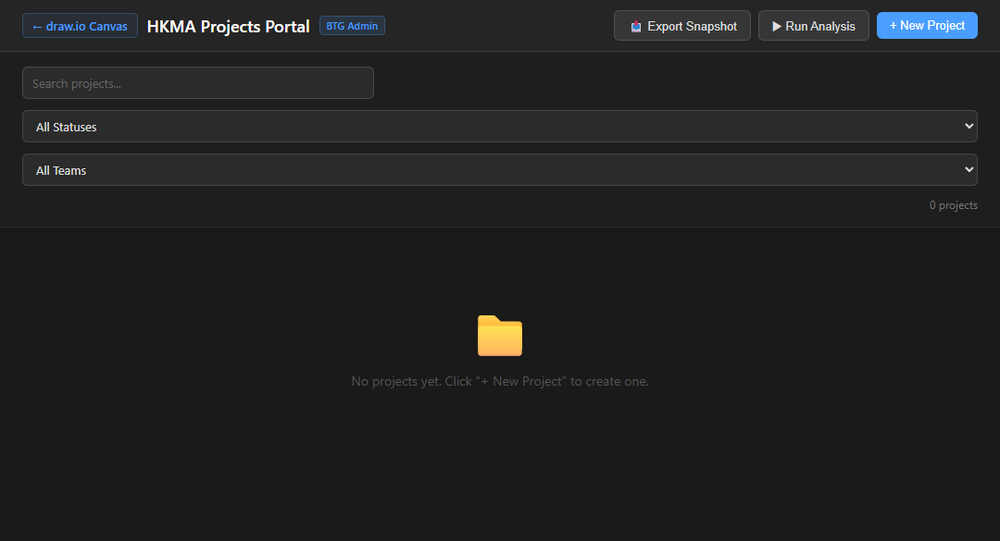

### 1.2 New Project modal

Click **+ New Project** — the modal collects name, code, owning team, status, assigned people, and description.

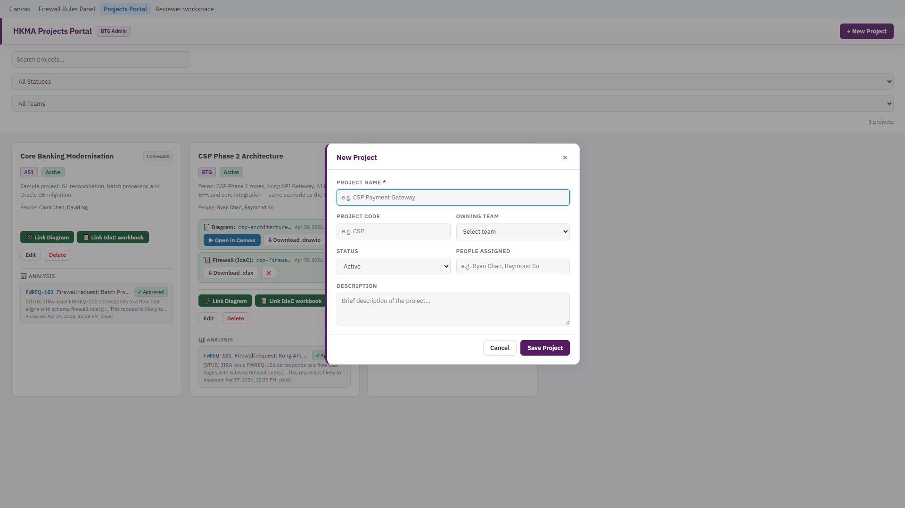

### 1.3 Project filled in

Sample project filled with a project code (`CSP`), team (`BTG`), assignees and description. The Project Code matters: the analysis service uses it to match JIRA issues to your project.

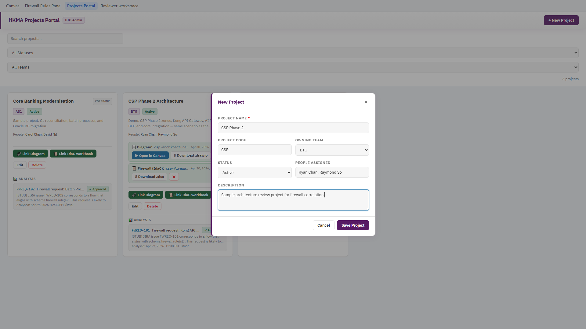

### 1.4 Project card after save

The new project appears as a card in the grid. Status badge (green = Active), team badge, and per-card actions (Link Diagram, Link Firewall JSON, Edit, Delete).

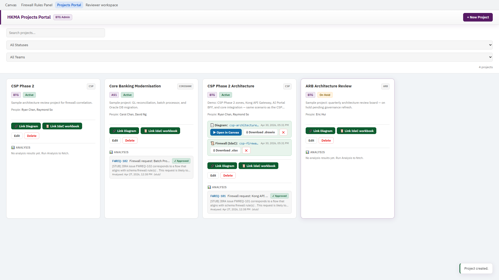

### 1.5 Multiple projects with filters

With several projects in the grid, the search box and Status / Team filters narrow results in real time. The right-hand counter shows `X of Y projects`.

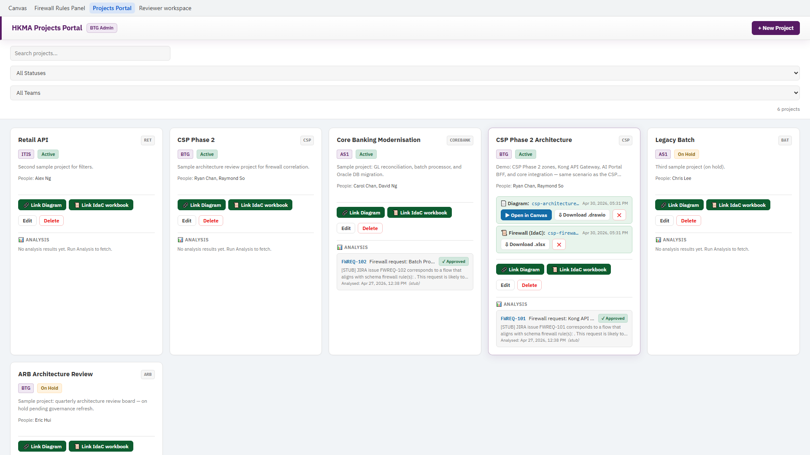

### 1.6 Linking a `.drawio` diagram

Click **🔗 Link Diagram** on a card — the native OS file picker opens, accepting only `.drawio` and XML files. (No screenshot — the picker is rendered by the OS, not the app.)

### 1.7 Linked diagram strip

After linking, a green strip on the card shows the filename, link timestamp, **▶ Open in Canvas**, **⬇ Download .drawio**, and **✕** unlink controls.

### 1.8 Linked firewall JSON

A second strip appears once a firewall-requests JSON is linked. It exposes **▶ View JSON** (opens in a new tab) and the same download/unlink actions.

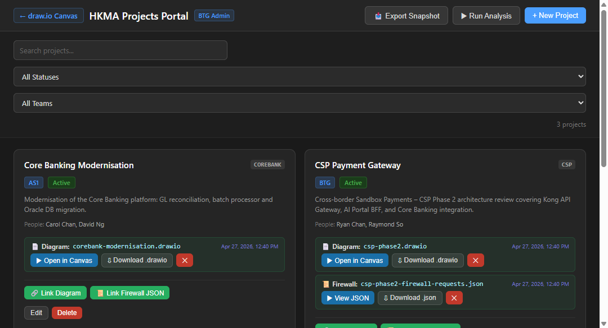

### 1.9 Analysis panel — offline

When the analysis service isn't running, every card shows a gentle offline notice. The portal still works fully without the service.

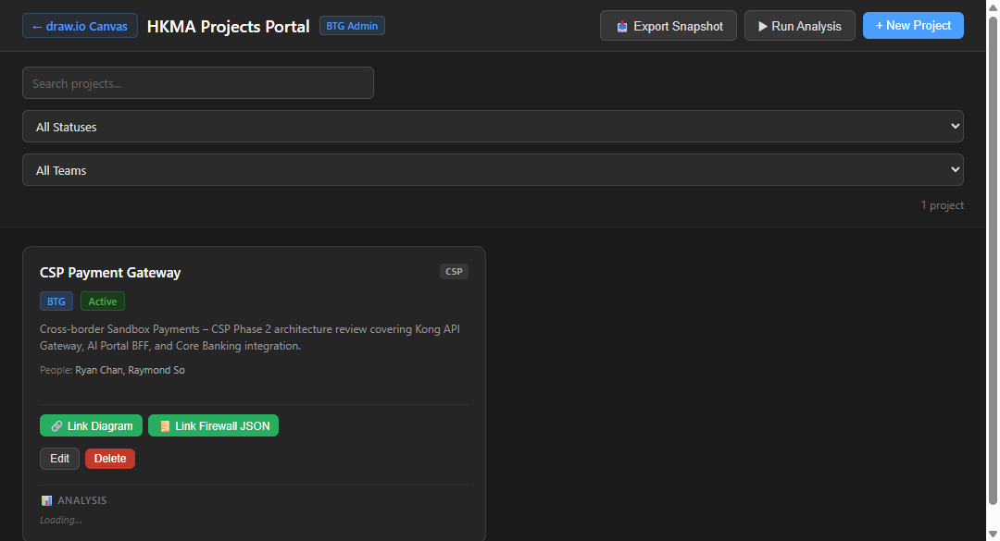

### 1.10 Analysis panel — online with results

After **▶ Run Analysis**, the per-card panel populates with the latest LLM analysis: JIRA key, summary, outcome badge (✓ Approved, ⚠ Clarification, ↻ Pending), and a timestamp.

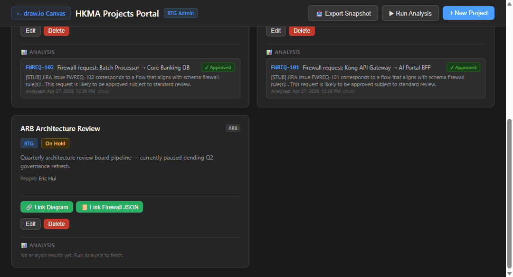

### 1.11 Export Snapshot toast

Clicking **📤 Export Snapshot** downloads the snapshot file *and* pushes it to the analysis service. A toast confirms the result.

### 1.12 Edit modal pre-populated

Editing a card re-opens the modal pre-filled with current values.

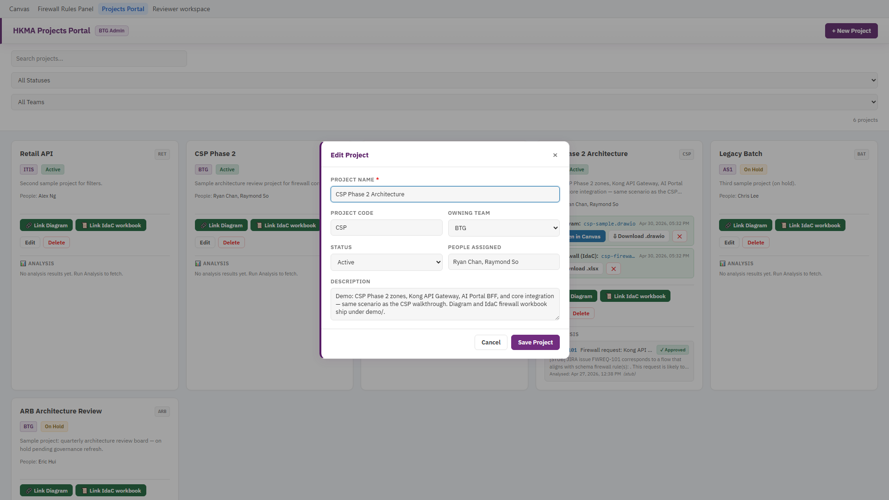

### 1.13 Delete confirmation

Deleting a project asks for confirmation in a centered dialog before clearing the record.

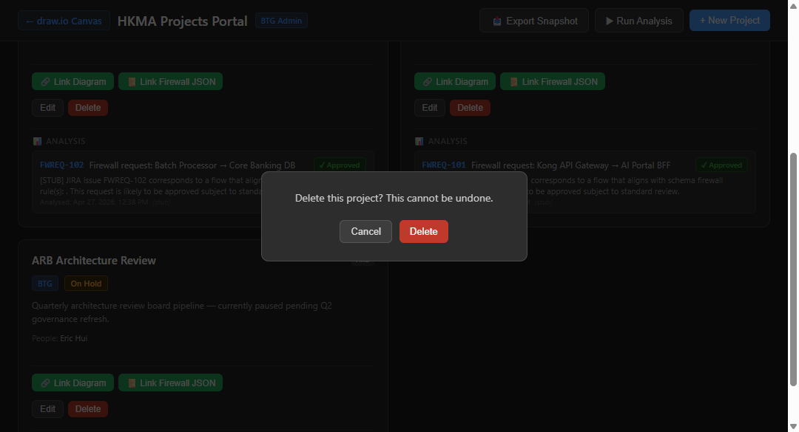

---

## Part 2 — Canvas (Architect View)

### 2.1 Canvas landing

The canvas opens with an empty diagram and the standard draw.io chrome. The left sidebar contains the **Architecture** group at the top.

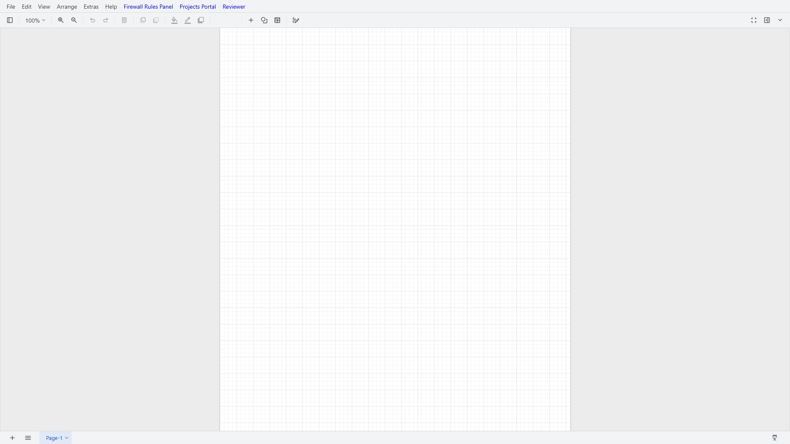

### 2.2 Architecture sidebar — Zones

Expanded **Zones** sub-section showing all 13 HKMA-aligned containers (OA Baremetal, IDMZ, K8s Cluster, etc.).

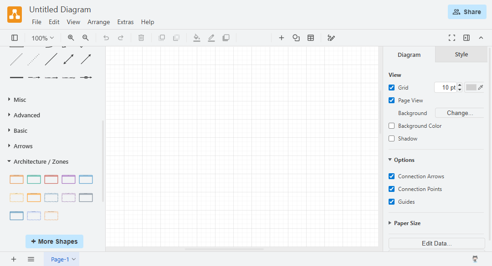

### 2.3 Architecture sidebar — Components

Expanded **Components** sub-section organised by category. Drag any shape into a zone to make it a child.

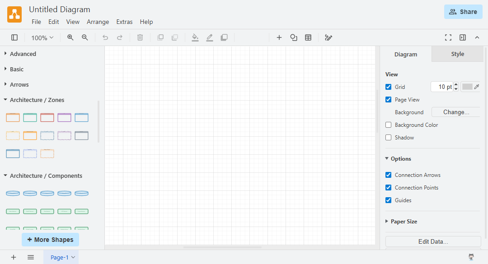

### 2.4 File menu — architecture entry points

The custom architecture commands are integrated into the standard **File** menu:
**Export Diagram (.drawio)**, **Extract Firewall Requests JSON**, **Extract Firewall Analysis JSON**, **Architecture Admin**, **Projects Portal**.

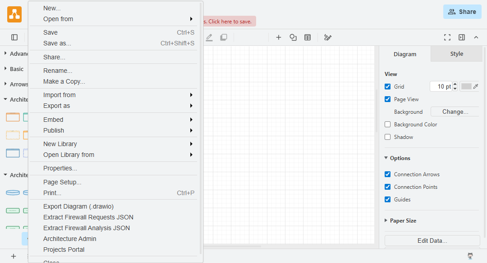

### 2.5 View menu — validation entry points

The **View** menu surfaces validation tooling alongside the standard view options:
**Validation Rules**, **Run Validation Self-Test**, **Architecture Admin**.

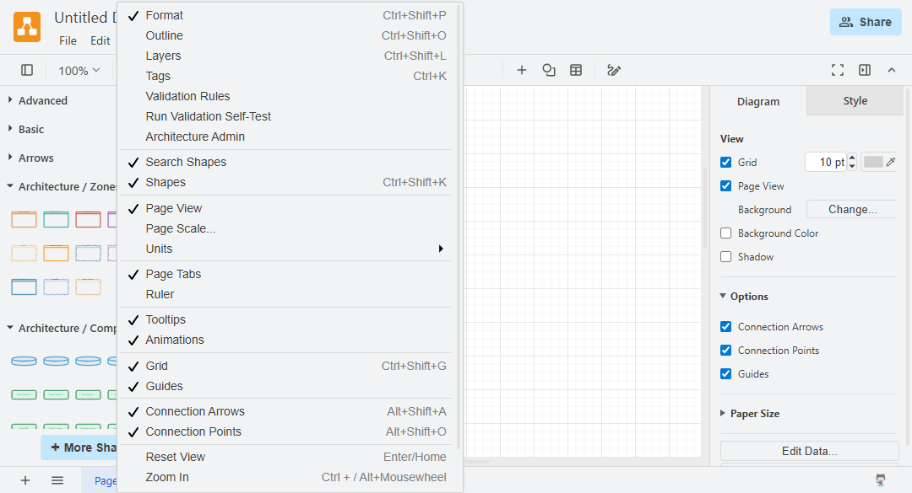

### 2.6 Architecture Catalog — Zones tab

CRUD for zones. The same dialog has tabs for Component Categories, Components, Styles, and Firewall Rules.

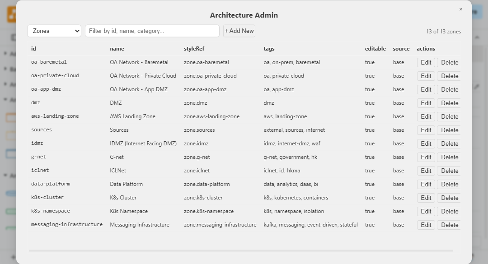

### 2.7 Architecture Catalog — Firewall Rules tab

Declarative firewall rule chain. Higher priority wins; rules can match `sameParent`, `sameZone`, `crossZone`, or specific `zoneId` lists.

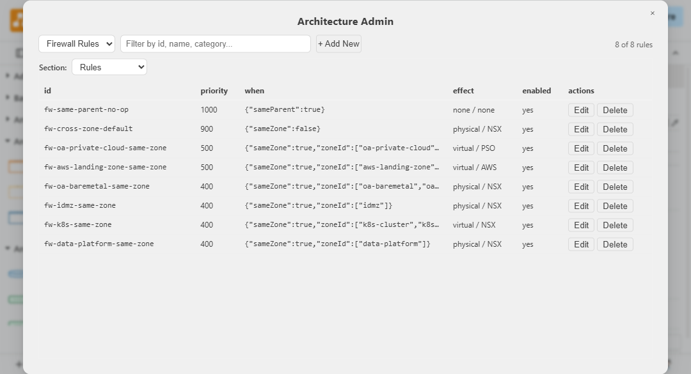

### 2.8 Validation Rules dialog — list

The form-driven validation rules dialog. Top toolbar switches between **Connection Rules** (edges) and **Placement Rules** (containment). Each rule shows a severity dot and DENY/ALLOW badge.

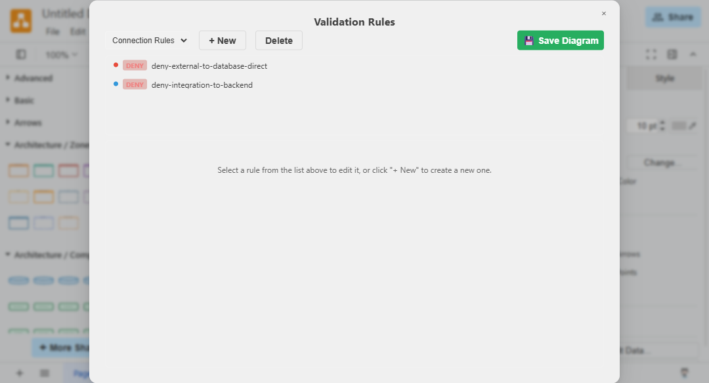

### 2.9 Validation Rules dialog — edit form

Selecting a rule reveals the form: Rule ID, Enabled toggle, Effect radio (Deny/Allow), Severity dropdown, Priority, From/To Category chip multi-selects, Same Zone / Cross Zone / Same Parent Container checkboxes, From/To Zone chips, and a violation message.

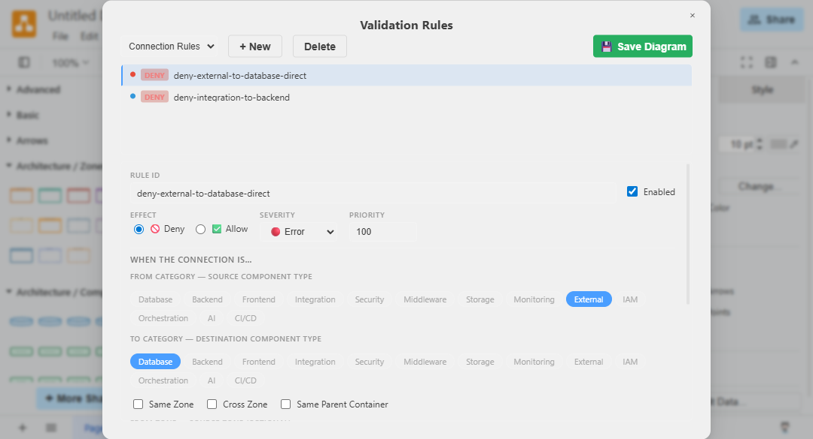

### 2.10 Validation Self-Test results

The built-in self-test runs the canonical fixtures against the rule engine and reports pass/fail counts plus per-fixture details.

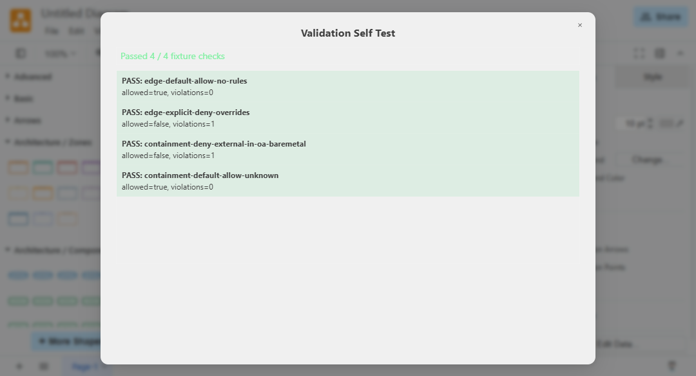

### 2.11 Validation result — denied edge

When a user draws an edge that violates a rule, the canvas blocks the connection and surfaces the rule's message (e.g. *"Denied by precedence"*).

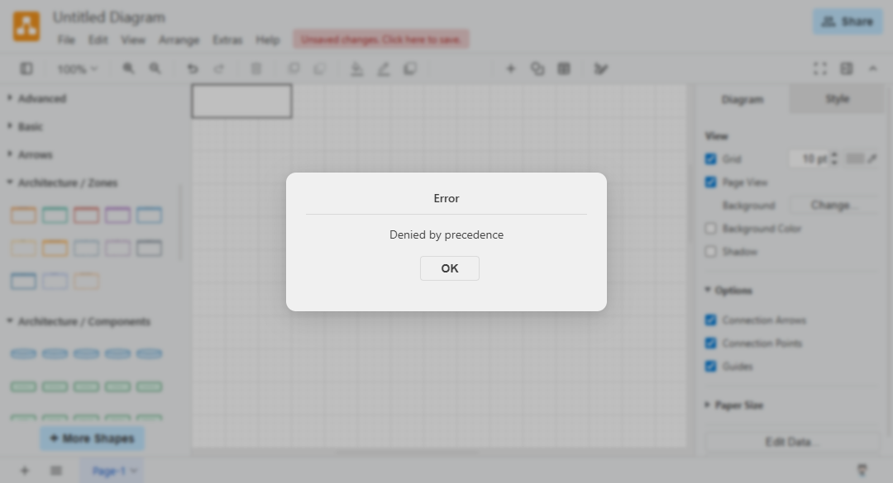

### 2.12 Firewall extraction preview

**File → Extract Firewall Requests JSON** shows the rendered output (validation summary plus the JSON body) before you copy or download.

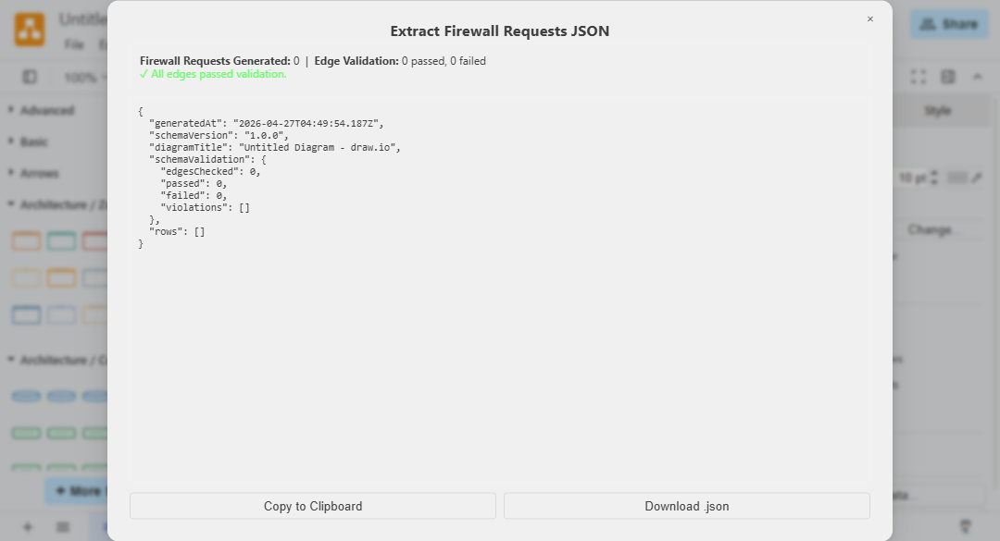

---

## Part 3 — End-to-end loop

### 3.1 Architect saves & exports

Architect saves the `.drawio` file and downloads `csp-phase2-firewall-requests.json`. Both go to the BTG admin via email/share.

### 3.2 BTG admin links files

BTG admin opens the Projects Portal, links both files to the project card.

### 3.3 BTG admin runs analysis

BTG admin clicks **📤 Export Snapshot** (so the service can correlate JIRA → project) then **▶ Run Analysis**.

### 3.4 BTG admin reads results

After ~4 seconds, each card's analysis panel shows the per-issue outcomes. Cards with ⚠ Clarification get priority follow-up.

---

> **Live demo tip:** Run the `service/` backend in stub mode (`npm start` with no `.env` values) — three sample JIRA issues will produce realistic-looking analysis results without any external dependencies.
